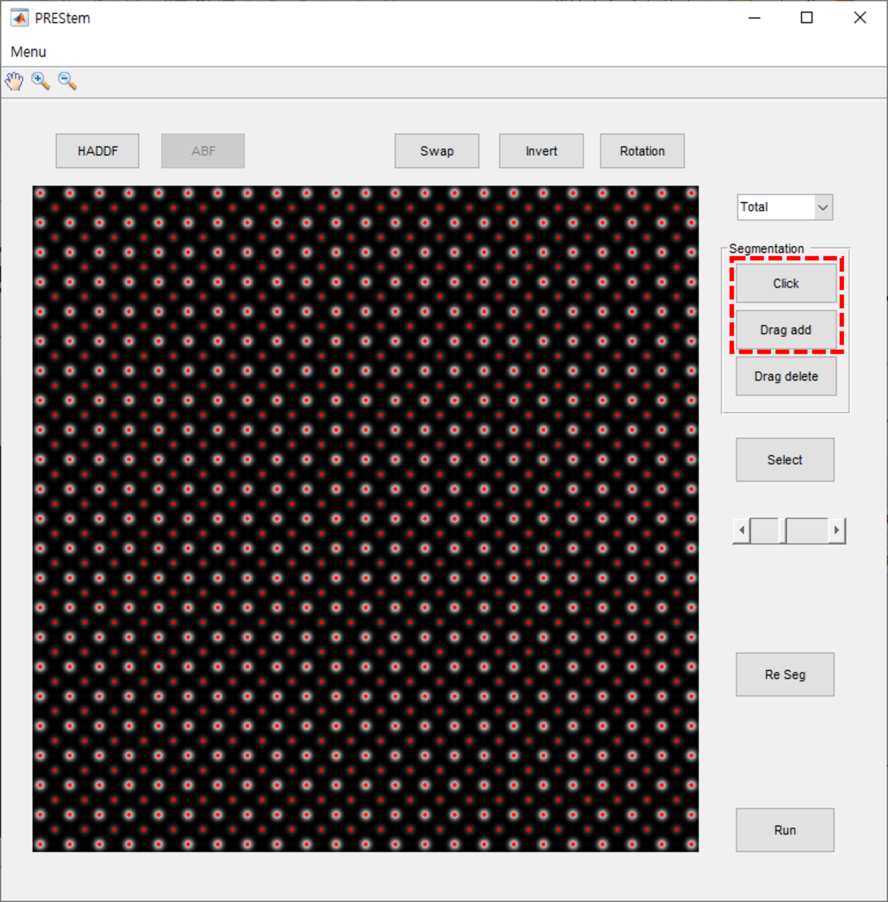

# PRESTem   

If your matlab version is R2020b, run the PRESTem.exe file, otherwise run the MyAppInstaller_web.exe file.   

## Usage   

1. Click the Menu toolbar and press the File Open button   

   
2. Select the image you want to analyze.   

    If you want to analyze ABF and HAADF images at the same time, please select images at the same time.   
    
        
3. Enter the parameters of the image.
 

  
4. Press the Click button or Drag add button to segment atoms.   
   As for the Click button function, the left mouse button is an add function, the right mouse button is a remove function, and the mouse wheel button or the esc key is an end function.

  
5. Press the Select button and drag to select a unit cell.

 
 
6. Enter the atomic information of the unit cell.   
   Atomic selection works the same way as a click button.

7. Check that the atomic information is entered correctly and click the Run button.   
   If the atomic peak is not correct, please press the Reg button.

8. The Analysis Results window appears.   
   If the atomic peak is wrong, correct it and click the run button again.   
   If you also selected the ABF image, press the ABF button, and then press the Run button again.

   The analysis results are saved in the result folder.
   

